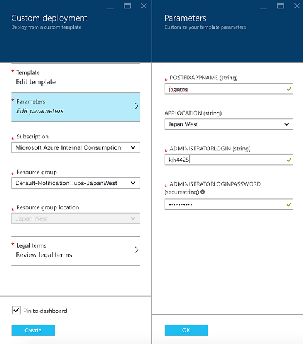

### CloudBread-ARM
This porject is automatic provision script for CloudBread service instances on Cloud.

CloudBread-ARM project is using Microsoft Azure Resource Manager for automatic service deployment.  
1. Mobile App deployment  
  
2. Admin web page deployment  
  
3. Others(Socket, Database, Noti) deployment  
  

### Resources info
Resource naming comvention
 * properName-CloudBread-Role-ResourceType-stagingStatus-dataCenterLocation

 ex) redis name: jhapp-cb-redis-dev-jp

 * Detail info

Resource|Detail
---|---|
Resource Group|Created new, or used the established resource group.
Redis|For the leader board (ranking system), handling massive game log data saving queue, real time socket Authentication.
Noti Namespace|Namespace of notification hubs.
Notification Hubs|Notitfication hub for the push alarm.
Server Name|Sql server for application.
Database Name|Azure Relational database.
Storage Accounts Name|[Key : Value] type Database for saving game log.
Mobile App|mobile app.
Admin Web App|admin web page.
Web App(Socket)|socket page.

### Direction
1.Fork the Cloudbread-ARM to personal repository.

2.Click the [Deploy to Azure] button.

3.Fill in the blanks about parameter. and Click the [OK] button.

4.Make a new resource group, or use the existed resource group.

5.Wait a minute, and then deployment was completed!

#### And then, follow the Continuous Deployment with automation
1.Fork the Cloudbread project to personal repository.

2.Enter the Azure cloud portal site.

3.In the resource group, find the MobileApp and click it.

4.In the MobileApp, click setting and find Continuous deployment.

5.Choose source what you want.

6.GitHub -> you must have the Cloudbread repository that you forked previously.
  select the all of things as below screen, and click the [OK] button.

7.Now, Continuous deployment success!

